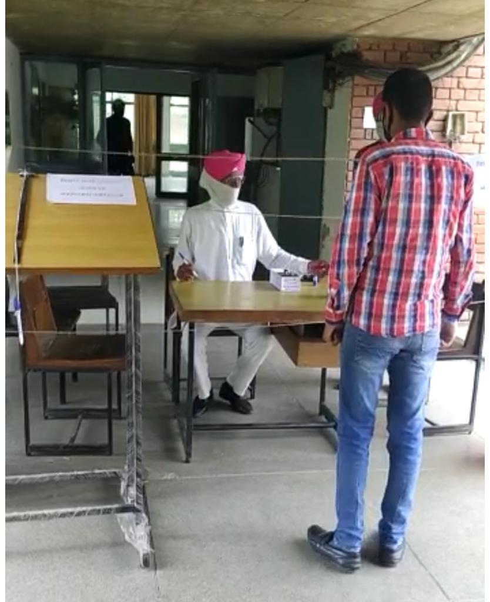

# Department of Electrical Engineering  

## Message from HoD's Desk

Technical education blended with ethics and quality comprises of one of the most powerful tools, which gives shape to the coming generations. We at Guru Nanak Dev Engineering College, Ludhiana are trying our level best to make optimized utilization of modern tools and techniques, so that quality technical education can come within the reach of the large masses of India with convenience and affordability.
I am very hopeful that the publishing of the present College Newsletter will showcase our valuable achievements to the world, which the students and staff have made in spite of all the past and ongoing natural and man-made hurdles.
I am thankful to GOD almighty for making us capable to perform these tiny but effective efforts. Last but not the least, I congratulate the whole Editorial Board and all involved for their fine individual and team works.

Dr. Kanwardeep Singh     
Associate Professor and H.O.D.    
(Department of Electrical Engineering)

## Department at Glimpse

**TEQIP-III sponsored
ICT enabled FDP on Energy Conservation and Management** :

A one week TEQIP III sponsored ICT enabled Faculty Development Program
on Energy Conservation and Management was organized by Electrical
Engineering Department from April 27- May 1, 2020. The call for registration
was floated online through Google forms and an overwhelming number of
participants: 202 registered for the program. Keeping in view the logistics, it
was decided to conduct the program twice with around 100 participants in each batch.

- ***The organisation of the event*** :
Dr. D P Kothari, Ex-director, IIT, Delhi, Ms. Sangita Kapoor,
Director, Blue Planet, Kolkata, Dr.Parag Nijhawan, TIET, Patiala, Dr. Y.S.Brar,
IKGPTU, Kapurthala, Dr.Y.P.Verma, UIET, Chandigarh, Er. Money Khanna,
PEDA, Chandigarh, Dr. Kanwardeep Singh &amp; Dr. Arvind Dhingra, GNDEC,
Dr. Ritula Thakur, NITTTR, Chandigarh, Dr. Pradeep Rajan, CMERI-
MERADO, Ludhiana, Dr. Sudhir Sharma, DAVIET, Jalandhar, Dr. Saurabh
Ratra, PAU, Ludhiana were the expert speakers for various sessions. The
participants were introduced to various topics like energy conservation and its
need, circular thinking, fuel cell, demand side management, energy
management standards, role embedded systems in energy conservation, micro
grids, green buildings, energy management in farm sector, impact of COVID 19
on Indian power sector.
The inaugural and valediction programs were attended by Principal Dr. Sehijpal
Singh who appreciated the efforts of the department for organizing such an event.

(**Pf.Rupinderjit Singh** attended LISD Conference Jan 2020)

( **Pf. Rupinderjit Singh** at Oxford, Oxfordshire foreign dignitaries )

( **Pf.Arvind Dhingra  and pf. Rupinderjit Singh** at IIT Delhi attended TEQIP-3 sponsored program on "Biomass to Energy and other value added products" at IIT Delhi from 25 th Nov  )

( **Pf. Rupinderjit Singh** at IIT Delhi )

(**Pf. Arshdeep Kaur, Pf. Gagandeep Kaur Gill and Pf. Sonia Grover** ) attended TEQIP-3 Sponsored Faculty Development Programme on "Machine learning for Engineering Application" at IIT Delhi)

## Faculty Achievements

- **Dr. Arvind Dhingra** published book	Electronics – Electrician domestic Job Role Electrician Domestic: NSQF Level-2,MBD Publications, March,2020: ISBN 2002M5507C5779

-  **Dr. Arvind Dhingra** won Dr.Sarvepalli Radhakrishnan Award at Educator’s Commemoration Ceremony by MentorX, September 5,2020.
- **Dr. Arvind Dhingra** won I2OR National eminent Educator Award 2020, I2OR.
- **Dr. Arvind Dhingra** won ISTE Best teacher award 2020 awarded at Chandigarh University, ISTE Teachers Convention, 2020, December 23,2020
- **Er. Karanbir Singh** got Best Paper Award  for a paper entitled Residential Load  profile optimization using DSM  by  incorporating  models  of  Appliances  at  TEQIP-III sponsored  International Congress  on  Sustainable  Development  through  Engineering  Innovations  held  on September  17-19,  2020,  organized  by  the  college  in  association  with  Indian Geotechnical Society: Ludhiana Chapter and  Institution  of  Engineers (I): Ludhiana Center.

## Publications  

- **Dr Kanwardeep Singh**], Research Paper Titled “Optimizing Distributed Solar Photovoltaic Power Generation in Day- Ahead Electricity Market Incorporating Irradiance Uncertainty" published in Journal of Modern Power
Systems and Clean Energy (Science Citation Index Expanded, ISSN: 2196-5625/ e-ISSN:2196-5420, impact factor: 3.09, open access), October 21st ,2020
- **Mr. Mukesh** under the guidance of **Dr. Kanwardeep Singh** has presented the research paper titled “Contingency Ranking Through Different Methods and Reliability Enhancement Using Distributed Generation” in International Conference on Advancements in Engineering and Technology, Bhai Gurdas Institute of Engineering & Technology, Sangrur, Punjab, India, on July 21st  2020.
- **Dhingra Arvind**, Singh Parminder, Nijhawan Parag, Model reduction of linear time invariant SISO systems using different optimal techniques, International Conference on Sustainable Developments through Engineering Innovations SDEI’20, Guru Nanak Dev Engineering College, Ludhiana, September 17-19th,2020

- **Dhingra Arvind**, Nijhawan Parag, Manish Kumar Singla, Meera Sharma, Sensor based optimization of energy in internet of things: A review, International Conference on Sustainable Developments through Engineering Innovations SDEI’20, Guru Nanak Dev Engineering College, Ludhiana, September 17-19th,2020

-	**Dhingra Arvind**, Sidhu Sukhjot, Day ahead forecasting in PSPCL, International Conference on Sustainable Developments through Engineering Innovations SDEI’20, Guru Nanak Dev Engineering College, Ludhiana, September 17-19th,2020

- **Dhingra Arvind**, Singh Tejinder, Energy conservation for sustainable future, International Conference on Sustainable Developments through Engineering Innovations SDEI’20, Guru Nanak Dev Engineering College, Ludhiana, September 17th-19th,2020.

- **Dhingra Arvind**, Kumar Ashwani, Comparision & Validation of a real time Simulink model of induction furnace, Test Engineering & Management,(Scopus Indexed), Vol. 83, May-June,2020, pp 23561-23566

- **Rupinderjit Singh** "Modelling and simulation smart grid system in simulink" LISD Conference and published in Journal of OXFORD UNIVERSITY (UK) Library January 12th 2020.

- **Navneet Singh Bhangu**,   Application of Fault Tree Analysis for Evaluating Reliability: A Case Study of Gear Box of Wind Turbine, International Journal of Advanced Science and Technology Volume 29 Issue 3, March 2020, ISSN: 2005-4238 (Print), ISSN: 2207-6360 (Online), Pages: 4486-4492, SCOPUS Indexed Journal.

- **Karanbir Singh**, **Kuldeep Singh** and **Amandeep Singh Ghatora** ,presented paper titled “Residential Load Profile Optimization using DSM by incorporating models of appliances”, in SDEI international conference September 17th -19th 2020.

- **Karanbir Singh**, presented research paper titled  “Demand Side Management for cost and peak load optimization with load modelling”, in IEMERA in Imperial College, London, U.K from  March 26th-28th 2020.

- **Gagandeep Kaur Gill** and **Rupinderjit Singh** presented paper titled “Bagasse congeneration plant efficiency improvement by using data envelopment analysis models"in SDEI international conference September. 17th -19th 2020.

- **Arshdeep Kaur** and Dr. Y.S Brar , presented paper titled "Optimization of Power System Using Static Synchronous Compensator to Enhance Voltage Stability" in SDEI international conference September 17th -19th 2020.

## Events Organized (FDPs/Conferences/STCs/SDTs/Workshops/Webinars etc.)  

| Sr. No. | Name of Event                                                  | Faculty Coordinator           | Duration | Date(s)               | Sponsor(s) |
|:--------|:---------------------------------------------------------------|:------------------------------|:---------|:----------------------|:-----------|
| 1       |ICT enabled FDP on Energy Conservation and Management(Run-1) | Dr Arvind Dhingra | One Week | April 27- May 1, 2020.  | TEQIP-III  |
| 2       | ICT enabled FDP on Energy Conservation and Management (Run-2) | Dr Arvind Dhingra | One Week | 04-08 May, 2020 | TEQIP-III  |

## Events Attended (FDPs/Conferences/STCs/SDTs/Workshops/Webinars etc.)  

| Sr. No. | Name of Faculty | Name of Event | Duration | Date(s) | Organizing Institute |
|:--------|:----------------|:--------------|:---------|:--------|:---------------------|
|1|Dr. Arvind Dhingra |  FDP   on Additive Manufacturing & Process optimization             |1 Week| April 9th-13th , 2020| NITTTR, Chandigarh |
|2|Dr. Arvind Dhingra |  FDP on Green and Intelligent Buildings |1 Week |April 14th-18th,2020  | NITTTR, Chandigarh |
|  3   |      Dr. Arvind Dhingra           |    FDP on Technological Advancement in Power System Control, Power Controllers, drives & E- Vehicles- TAPPAD2020           |     1 Week     |   April 27th- May 1st,2020      |               Dr NGP Institute of Technology, Coimbatore       |   
|4|Dr. Arvind Dhingra|IGEN PIT FDP on Renewable Energy Systems	|1 Week|June 8-12th , 2020|The Institution of Green Engineers, Panimalar Institute of Technology, Chennai|
| 5 |          Dr. Arvind Dhingra         |     TEQIP-III sponsored Efficient, trackable and sustainable workflow, Examination Branch          |     1 Week    |      December 2nd -7th, 2020    |           GNDEC, Ludhiana           |
|6|Dr. Navneet Singh Bhangu|Energy Conservation and Management, TEQIP-III sponsored ICT enabled FDP|1 week|April 27 to May 1, 2020|EED at GNDEC, Ludhiana|
|7|Dr. Navneet Singh Bhangu|Online AICTE Recognized FDP On	Waste Management|1 week| May 11th -15th 2020| Mechanical Engg. Deptt., NITTTR Chandigarh|
|8|Dr. Navneet Singh Bhangu|Education 4.0: Reliability Centered Maintenance, Webinar|1 day|July 19th 2020 |School of Mechanical Engineering (SMEC) Vellore Institute of Technology, Chennai
|9|Dr. Navneet Singh Bhangu|Professional Development Training Program for Faculty and Administrators of Project Institutions of TEQIP-III, National Project Implementation Unit, MHRD, Govt. of India|2 days|26 to 28 November 2020|Indian Institute of Management (IIM),Visakhapatnam
|10|Dr. Navneet Singh Bhangu|Digital Transformation of Institutions of Higher Learning|1 week| December 1st -6th 2020| National Academy of Human Resource Development,New Delhi|
|11|Er. Rupinderjit Singh|Education 4.0: Reliability Centered Maintenance, Webinar|1 day|19th July|School of Mechanical Engineering (SMEC) Vellore Institute of Technology, Chennai
|12|Er. Rupinderjit Singh|Professional Development Training Program for Faculty and Administrators of Project Institutions of TEQIP-III, National Project Implementation Unit, MHRD, Govt. of India|2 days|26 to 28 November 2020|Indian Institute of Management (IIM),Visakhapatnam
|13|Er. Ravinder Kaur|Two Weeks AICTE Sponsored FDP Under AQIS:Innovative Pedagogical Methodologies And Tools For Effective Learning In Engineering Education|2 Weeks| October 26th to November 7th, 2020|Department Of Business Administration,GNDEC,Ludhiana|
|14|Er. Samreet Kaur|AICTE Sponsored FDP Under AQIS:Innovative Pedagogical Methodologies And Tools For Effective Learning In Engineering Education|Two Weeks |October 26th to November 7th, 2020| Department Of Business Administration,GNDEC,Ludhiana||
|15|Er. Amandeep Singh|FDP on “Advanced Optimization Techniques and hands-on with MATLAB/SCILAB”|2 Week|13 – 24 July 2020|Electronics and ICT Academies” by the Ministry of Electronics and Information Technology (MeitY), Government of India.|
|16|Er.Amandeep Singh|Webinar on"Power Monitoring, Home Automation and Building Management System"|1 Week|June 29-3 July 2020|School of Electrical Engineering KIIT, Bubnehwar and Schneider electric india|
|17| Er. Amandeep Singh|Webinar on ABB Heavy Vehicle Charging|1 Day|July 7th 2020|ABB Australia|
|18|Er. Amandeep Singh|Electric Vehicle:New Trends and Technologies|1 Week| 22-26 June 2020|ABES Engineering College, Ghaziabad|
|19|Er. Karanbir Singh|FDP on “Advanced Optimization Techniques and hands-on with MATLAB/SCILAB”|2 Week|13 – 24 July 2020|Electronics and ICT Academies” by the Ministry of Electronics and Information Technology (MeitY), Government of India.|
|20|Er. Karanbir Singh|Webinar on"Power Monitoring, Home Automation and Building Management System"|1 Week|June 29-3 July 2020|School of Electrical Engineering KIIT, Bubnehwar and Schneider electric india|
|21|Er. Gagandeep Kaur Gill|TEQIP –III sponsored STTP on “PLC, Drives and Industrial Automation”|1 Weeks|March 2nd -6th,2020|Sant Longowal Institute of Engineering and Technology, Longowal|
|22|Er. Gagandeep Kaur Gill|Two Week Faculty Development Programme on “Digital Design and Emerging Trends in Signal Processing”|2 Weeks| August 10-22, 2020|Department of Electronics & Communication Engineering, Government Engineering College Bikaner.
|23|Er. Gagandeep Kaur Gill| Innovative Pedagogical Methodologies And Tools For Effective Learning In Engineering Education|2 Weeks| December 7th to  December 21st, 2020|Department Of Business Administration, GNDEC,Ludhiana|
|24|Er. Bhawna|Innovative Pedagogical Methodologies and Tools for Effective Learning in Engineering Education |2 Weeks| December 7th to  December 21st, 2020|Department Of Business Administration,GNDEC,Ludhiana|
|25|Er. Bhawna|  AICTE approved FDP course on "Electrical Vehicles ”|4 Week|January – March 2020| NPTEL Online Course.
|26|Er. Arshdeep Kaur|TEQIP –III sponsored STTP on “PLC, Drives and Industrial Automation”|1 Weeks|March 2nd -6th,2020|Sant Longowal Institute of Engineering and Technology, Longowal|
|27|Er. Arshdeep Kaur|Two Week Faculty Development Programme on “Digital Design and Emerging Trends in Signal Processing”|2 Weeks| August 10-22th, 2020|Department of Electronics & Communication Engineering, Government Engineering College Bikaner|
|28|Er. Arshdeep Kaur|One-week Online Short Term Training Program (STTP) on “Recent Trends in Instrumentation Engineering”|1 Week|September 7th-11th, 2020|Department of Electrical Engineering, NIT, Uttarakhand and Department of Electrical & Instrumentation Engineering, SLIET Longowal, Punjab
|29|Er. Arshdeep Kaur|Two Weeks AICTE Sponsored FDP Under AQIS:Innovative Pedagogical Methodologies And Tools For Effective Learning In Engineering Education|2 Weeks| October 26th to November 7th, 2020|Department Of Business Administration,GNDEC,Ludhiana|
|30|Er. Arshdeep Kaur|  AICTE approved FDP course on "Introduction to smart grids ”|8 Week|September 14th-December 18th, 2020| NPTEL Online Course

## Student's Corner  

 **Sukhchain Singh** (D3EE) made project "**2 meter waring system** for staff who is on COVID -19 Government Duty under the guidance of **Pf. Gagandeep Singh Sodhi**

### Student's Achievements

Project filed for Patent in December 2020.

- **1.Abhishek Goyal, Gurpartap Singh, Kunal Singla and Mainik Walia**
 made the project "Sky Robot" under the guidance of **Dr. Arvind Dhingra** .This robot is to help maintain a vigil against unwanted intruders. The robot is so designed so as to work effectively during day and night with same efficiency. The robot is capable of sending an alarm in case of any unwanted activity. This will help our soldiers guarding our borders to maintain effective vigil.

- **2. Santokh Singh, Sapandeep Singh,Simranjeet Singh and Harpreet Singh** made the project "Palace Power Saver" under the guidance of **Pf. Arshdeep Kaur**. One of the major reason for designing this project, is the wastage of electricity especially at palaces, libraries, hostels, hotels, cinemas, parking and offices, where no one take responsibility to switch off the electrical equipment. This project is based on an intelligent electricity system which  automatically switched off the light/equipment when the room will empty.

**Project: Palace Power Saver**

### Electrical Engineering Staff and Students (E2S2)
 - Organised online quiz " **MIND MANTRA** " Coordinated by Dr.Arvind Dhingra, Pf.Gagandeep Kaur Gill and Pf.Amandeep Singh on July 2020.
