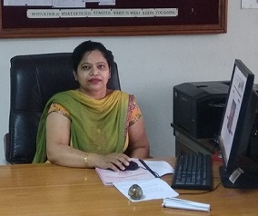

# Department of Information Technology

## Message from HoD's Desk

The Department of Information Technology (DIT) imposes impact on both the urban and rural area students. It helps to create groomed, technically competent and skilled students, so that they can compete with the current computing industry. Our department also provides technical solutions for the problems related to the local society. Department provides ample opportunities and tools to the students for grooming them as a productive and participating global citizens. In the end, I can say we incorporate the good communication and technical skills as well as moral and ethical values for the overall development of the individual.

## Department at Glimpse

- **STTP on “Artificial Intelligence and Machine Learning with Data Science” (Phase-I)**  

One week AICTE sponsored online Short Term Training Programme (STTP) on title “Artificial Intelligence and Machine Learning with Data Science” has been inaugurated on Monday.  This programme is organized by the Department of Information Technology, Guru Nanak Dev Engineering College (GNDEC), Ludhiana during 02nd-07th November 2020.  AICTE under Quality Improvement Scheme (AQIS) enables the faculty members/ research scholars to introspect & learn latest techniques that can help them to contribute for the betterment of themselves & society through knowledge enhancement.
Dr. Deepak Garg Prof. HOD CSE (Bennet University, Noida) and Director (leadingindia.ai, NVIDIA-BCRAI) inaugurated this online programme as chief guest and shared his expert opinions on various research challenges in the domain of artificial intelligence. While sustaining the interactive session, Dr. Garg responded all queries of the participants. He enlightened the various benefits of using the artificial intelligence like reduction of time taken to perform a task, enabling the execution of hitherto complex tasks without significant cost outlays, 24*7 operations without interruption with no downtime, and enhancing the capabilities of differently abled individuals. Dr. Jitender Kumar Chhabra from NIT Kurukshetra delivered the expert talk on the topic “Adding Intelligence to Engineering Systems”.
Dr. Sehijpal Singh, Principal of GNDEC conveyed that e-learning is the optimum solution during this epidemic current situation and appreciated the efforts of the organizers. He enlightened the significance of AI, ML and Data Analytics in all evolving disciplines.

- **STTP on “Cyber Security-Current Trends and Future Perspective” (Phase-I)**  

 Information Technology Department of Guru Nanak Dev Engineering College, Ludhiana concluded the weeklong series of lectures and hands-on practice sessions held in the online AICTE Sponsored Short Term Training Programme (STTP) on title “Cyber Security – Current Trends and Future Perspective”. This online training programme was conducted during 09th-14th November 2020 from the High Performance Computing Lab of the Information Technology Department. AICTE under Quality Improvement Scheme (AQIS) enables the faculty members/ research scholars to introspect & learn latest techniques that can help them to contribute for the betterment of themselves & society through knowledge enhancement. This programme was organized with the objective to expose the faculty, research scholars and professionals to develop their competency and expertise over security and networking along-with providing the knowledge about the ongoing scenario in the area of cyber security. Various computer and cyber security threats such as identity theft, phishing attacks, email hoaxes, loss of confidential information and social engineering were elaborated in details with practical exposure.  Renowned and experienced resource persons from renowned organizations like IITs, NITs, NITTTR and GFSU etc. had shared their experiences on various topics in this STTP. Practitioners from industries like UNet Solutions, CyberSec Society and CDAC etc. had demonstrated the real time industry problems as well as methods used as recovery process for various significant issues. Various research concerns were also discussed by the experts in this STTP.
 Mr. Sanjay Sharma from IIT Kanpur was invited as keynote speaker and he shared his expert opinions on real time challenges identified in the current pandemic situation. Dr. Animesh Mukherjee from IIT Kharagpur elaborated the significance of “Hate Speech Dynamics in Social Media” with concern to the current scenario. Er. Vipin Gupta from UNet Solutions executed the hands on practice session on Intrusion Detection System. Mr. Ch A.S. Murty from CDAC Hyderabad pointed out various innovative ideas implemented at the industry and government level for the concern of cyber security. He shared his expert opinions on the topics of “Cyber Crime Scenario: Global and India Perspective” and “Open Source Tools for Cyber Security”. Dr. Haresh Barot from GFSU Gandhinagar delivered his expert talk on Fraud Detection & Forensic accounting with further elaboration of the real-time dataset. Dr. Somitra Kr. Sanadhya from IIT Ropar pointed out the roles of Cryptography & Zero-Knowledge Proofs with reference to the cyber security.

- **STTP on “Artificial Intelligence and Machine Learning with Data Science” (Phase-II)**  

 One week AICTE sponsored online Short Term Training Programme (STTP) on title “Artificial Intelligence and Machine Learning with Data Science” has been inaugurated on Monday.  This programme is organized by the Department of Information Technology, Guru Nanak Dev Engineering College (GNDEC), Ludhiana during 14th-19th December 2020.  AICTE under Quality Improvement Scheme (AQIS) enables the faculty members/ research scholars to introspect & learn latest techniques that can help them to contribute for the betterment of themselves & society through knowledge enhancement.
 Dr. Deepak Garg Prof. HOD CSE (Bennet University, Noida) and Director (leadingindia.ai, NVIDIA-BCRAI) inaugurated this online programme as chief guest and shared his expert opinions on various research challenges in the domain of artificial intelligence. While sustaining the interactive session, Dr. Garg responded all queries of the participants. He enlightened the various benefits of using the artificial intelligence like reduction of time taken to perform a task, enabling the execution of hitherto complex tasks without significant cost outlays, 24*7 operations without interruption with no downtime, and enhancing the capabilities of differently abled individuals. Dr. Jitender Kumar Chhabra from NIT Kurukshetra delivered the expert talk on the topic “Adding Intelligence to Engineering Systems”.
 Rest of the topics to shared in this STTP with practical demonstration (Hands-on practices) includes “Classification and Clustering Algorithms”, “Adding Intelligence to Engineering Systems”, “Data Analytics using Hive and HBase”, “Deep Learning with Tensor flow”, “Disruptive applications of AI in various industries with use cases & scientific solutions”, “Modern day methods of Anomaly Detection and their use in Security Industry”, “Spatial Data Science”, “Machine Learning with Urban Computing”, and “NLP with Deep Learning”, etc.
 Dr. Sehijpal Singh, Principal of GNDEC congratulated the coordinators for organizing much relevant programmes in the need of hour. He also conveyed that e-learning is the optimum solution during this epidemic current situation and appreciated the efforts of the organizers. He enlightened the significance of AI, ML and Data Analytics in all evolving disciplines.

 

- **STTP on “Cyber Security-Current Trends and Future Perspective” (Phase-II)**  

 Information Technology Department of Guru Nanak Dev Engineering College, Ludhiana concluded the weeklong series of lectures and hands-on practice sessions held in the online AICTE Sponsored Short Term Training Programme (STTP) on title “Cyber Security – Current Trends and Future Perspective”. This online training programme was organized during 14th-19th December 2020 from the Information Technology Department of GNE College. AICTE under Quality Improvement Scheme (AQIS) enables the faculty members/ research scholars to introspect & learn latest techniques that can help them to contribute for the betterment of themselves & society through knowledge enhancement. This programme was organized with the objective to expose the faculty, research scholars and professionals to develop their competency and expertise over security and networking along-with providing the knowledge about the ongoing scenario in the area of cyber security. In this STTP, various computer and cyber security threats such as identity theft, phishing attacks, email hoaxes, loss of confidential information and social engineering were elaborated in details with practical exposure.  Renowned and experienced resource persons from highly reputed organizations like IITs, NITs, GFSU, and GNDEC etc. had shared their experiences on various topics in this STTP. Practitioners from industries like UNet Solutions, HackersEra and CDAC etc. had demonstrated the real time industry problems as well as methods used as recovery process for various significant issues. Many research concerns were also discussed by the experts in this STTP.
 Dr. Sumit Kumar, Assistant Director (Income Tax Department, Ghaziabad) was invited as keynote speaker and he shared his expert opinions on real time challenges identified in the current pandemic situation. He enlightened various security breaches that could occur for a organization and also informed about the abundant security mechanisms used within the Income Tax department. Er. Vipin Gupta from UNet Solutions executed the hands-on practice session on Malware Detection and Mitigation. In the practical session, he also elaborated the deployment of web servers and databases in Virtual Private Cloud with security procedures.  Dr. Animesh Mukherjee from IIT Kharagpur mentioned the significance of “Hate Speech Dynamics in Social Media” with concern to the current scenario. Dr. Udai Pratap Rao from SVNIT Surat demonstrated his exposure for the Data Privacy Annonymization Techniques and Block Ciphers.

- **Five Days Faculty Development Programme on “Moodle Learning Management System”**  

 Five Days Faculty Development Programme on “Moodle Learning Management System” was organized by the Department of Information Technology, Guru Nanak Dev Engineering College, Ludhiana in association with the Spoken Tutorial, IIT Bombay during Monday to Friday. Online Test for the Successful Completion of this programme was conducted in the evening of May 2nd 2020. E-Participation Certificate were generated and distributed among the successfully qualified participants. Dr. Pankaj Bhambri and Er. Sachin Bagga, Course Coordinators from GNDEC informed that 429 candidates from different colleges and universities of India participated in this FDP, among them 232 male and 197 were the female participants. Moodle is free and open source software and it helps the teachers and educators to create online courses for an adaptive and customized learning. It is used by many small and large educational institutions to create and deliver courses online to their students. Spoken Tutorial Project is funded by the National Mission on Education through Information and Communication Technology, Ministry of Human Resource Development, Government of India and is recommended by NASSCOM as well. Dr. Bhambri enlightened that spoken tutorial project has many unique features w.r.t. other available online courses like self explanatory, uses multi-sensory approaches, small duration, learned-centered, learning by doing, and simultaneous empowerment. He mentioned that this course was organized free of cost among the curious learners. Dr. Sehijpal Singh, Principal of GNDEC conveyed that e-learning is the optimum solution during this epidemic current situation and appreciated the efforts of the organizers. GNDEC is already using the Moodle Platform successfully under the leadership of Dr. H.S.Rai, C.O.E. for the effective teaching learning process.

- **ATAL Program on AR and VR**

     
  

## Faculty Achievements  

- Dr. Amit Kamra got ISTE Best Teacher award.  

  

- Dr. Kiran Jyoti received an Grant of Rs. 2,58,333 for conducting STTP on "Artificial Intelligence and Machine Learning with Data Science" vide 601.15(a) dated 10th August 2020

## Publications  

- Singh, P., Kaur, A., Gupta, P. et al. RHAS: robust hybrid auto-scaling for web applications in cloud computing. Cluster Comput (2020). https://doi.org/10.1007/s10586-020-03148-5 (SCI Publication)

- Dr. Amit Jain, Dr. Manpreet Singh. HYBRID AND BLIND WATERMARKING APPROACH FOR THE SECURITY OFDIGITAL IMAGES IN RIDGELETDOMAIN. JCR. 2020; 7(17): 2428-2435. doi:10.31838/jcr.07.17.300

- Singh, Jagdeep, Sachin Bagga, and Ranjodh Kaur. "Software-based prediction of liver disease with feature selection and classification techniques." Procedia Computer Science 167 (2020): 1970-1980

- Singh, Jagdeep and Singh, Parminder. “A Sustainable Resource Allocation Techniques for Fog Computing.” Sustainable Development through Engineering Innovations held on September 17-19, 2020 Link : https://www.springer.com/in/book/9789811595530

- Gurpreet Kaur, Harjot et al. "Liver Disease Prediction Using Optimized feed forward Neural Network" in International Journal of Research and Analytical Reviews vol.7 issue 2 on June 2020

- Kriti Verma , Harjot Kaur."Twitter Based Sentimental Analysis of Online Education Learning Tools" International Journal of Research and Analytical Reviews vol.7 issue 3 on August 2020   801-805

- Singh, Jagdeep, Sachin Bagga, and Ranjodh Kaur. "Software-based prediction of liver disease with feature selection and classification techniques." Procedia Computer Science 167 (2020): 1970-1980.

- Singh, Swaranjit, Vivek Thapar, and Sachin Bagga. "Exploring the hidden patterns of cyberbullying on social media." Procedia Computer Science 167 (2020): 1636-1647.

## Events Organized (FDPs/Conferences/STCs/SDTs/Workshops/Webinars etc.)  

| Sr. No. | Name of Event                                                                                                                 | Faculty Coordinator                                           | Duration | Date(s)                | Sponsor(s)                                     |
|:--------|:------------------------------------------------------------------------------------------------------------------------------|:--------------------------------------------------------------|:---------|:-----------------------|:-----------------------------------------------|
| 1       | Short Term Training Program (STTP)  on Artificial Intelligence and Machine Learning with Data Science (AIMLDS-2020)           | Dr. Kiran Jyoti, Dr. Pankaj Bhambri, Dr. Sandeep Kumar Singla | One Week | 02-07 November, 2020   | AICTE-Quality Improvement Scheme (QIS) 2019-20 |
| 2       | Short Term Training Program (STTP)  on Cyber Security - Current Trends and Future Perspective                                 | Dr. Kiran Jyoti, Dr. Pankaj Bhambri, Dr. Sandeep Kumar Singla | One Week | 9 - 14 November, 2020  | AICTE-Quality Improvement Scheme (QIS) 2019-20 |
| 3       | Short Term Training Program (STTP)  on Artificial Intelligence and Machine Learning with Data Science (Phase 2) (AIMLDS-2020) | Dr. Kiran Jyoti, Dr. Pankaj Bhambri, Dr. Sandeep Kumar Singla | One Week | 14-19 December, 2020   | AICTE-Quality Improvement Scheme (QIS) 2019-20 |
| 4       | Short Term Training Program (STTP)  on Cyber Security - Current Trends and Future Perspective(Phase 2)                        | Dr. Kiran Jyoti, Dr. Pankaj Bhambri, Dr. Sandeep Kumar Singla | One Week | 14 - 19 December, 2020 | AICTE-Quality Improvement Scheme (QIS) 2019-20 |
| 5       | FDP on “Moodle Learning Management System”                                                                                    | Dr. Pankaj Bhambri, Er. Sachin Bagga                          | 5 days   | 27 April - 1 May, 2020 | Spoken Tutorials, IIT Bombay                   |
| 6       | ATAL Program on AR and VR                                                                                                     | Dr. Amit Kamra                                                | 1 week   | 23 - 27 Nov, 2020      | GNDEC, Ludhiana                                |

## Events Attended (FDPs/Conferences/STCs/SDTs/Workshops/Webinars etc.)  

| Sr. No. | Name of Faculty                                                                                                                | Name of Event                                                                                                | Duration | Date(s)                          | Organizing Institute                                                                    |
|:--------|:-------------------------------------------------------------------------------------------------------------------------------|:-------------------------------------------------------------------------------------------------------------|:---------|:---------------------------------|:----------------------------------------------------------------------------------------|
| 1       | Kiran Jyoti                                                                                                                    | Short Term Training on "Internet Of Things "                                                                 | 1 week   | 1 -7 June, 2020                  | Apptronix Technologies in collaboration with A.G Patil Institute of Technology, Solapur |
| 2       | Kiran Jyoti                                                                                                                    | "Information Security: Issues and Challenges (ISIC-2020)”                                                    | 1 week   | 17 -21 Nov, 2020                 | Motilal Nehru National Institute of Technology Allahabad                                |
| 3       | Kiran Jyoti                                                                                                                    | OUTCOME BASED EDUCATION: A STEP TOWARDS EXCELLENCE                                                           | 1 week   | 11 -15 May, 2020                 | Government College of Engineering, Karad, Margdarshan Scheme of AICTE, New Delhi        |
| 4       | Kiran Jyoti                                                                                                                    | Faculty Development for New Tomorrow: Readiness for teaching and learning post COVID-19                      | 1 week   | 24 -28 July, 2020                | NIT Uttrakhnad & SLIET , Longowal                                                       |
| 5       | Manpreet Singh                                                                                                                 | Managerial Skills for Interpersonal Dynamics                                                                 | 12 weeks | 27 Jan -17 April, 2020           | IIT Roorkee, Online through Swayam                                                      |
| 6       | Manpreet Singh                                                                                                                 | Disciplinary Rules and Procedure                                                                             | 2 days   | 8 -9 Dec, 2020                   | NAHRD, New Delhi                                                                        |
| 7       | Manpreet Singh                                                                                                                 | Digital Transformation of Institutions of Higher Learning                                                    | 1 week   | 1 - 5 Dec, 2020 NAHRD, New Delhi |                                                                                         |
| 8       | Sandeep Kumar Singla                                                                                                           | AICTE Training And Learning (ATAL) Academy Online FDP on "Cyber Security"                                    | 1 Week   | 6 -10 Oct,2020                   | Poornima Institute of Engineering & Technology.                                         |
| 9       | Sandeep Kumar Singla, Ranjodh Kaur, Kamaljit Kaur                                                                              | FDP On Open Source Learning Management System: Modular Object-Oriented Dynamic Learning Environment (MOODLE) | 1 week   | 16 - 22 June, 2020               | IIT, Bombay                                                                             |
| 10      | Sandeep Kumar Singla                                                                                                           | TEQIP-III sponsored webinar on  IPR and Patent Filing                                                        | 1 day    | 2 July, 2020                     | GNDEC, Ludhiana                                                                         |
| 11      | Sandeep Kumar Singla                                                                                                           | TEQIP-III Online STC on "Applications of Machine Learning in advancements of Computer Science"               | 1 week   | 17 - 12 Aug, 2020                | NIT, Jalandhar                                                                          |
| 12      | Sandeep Kumar Singla                                                                                                           | Faculty Development Program (FDP) on R Programming                                                           | 1 week   | 27 April -1 May, 2020            | Indo Global Group of Colleges, New Chandigarh                                           |
| 13      | Pankaj Bhambri                                                                                                                 | Workshop on “Train the Trainers on Examination Reforms”                                                      | 3 days   | 9 -11 January, 2020              | KLE Technological University, Hubli                                                     |
| 14      | Pankaj Bhambri                                                                                                                 | Faculty Development Program on “Internet of Things (IoT)” (OnlineMode)                                       | 5 days   | 20 -14 April, 2020               | NITTTR, Chandigarh                                                                      |
| 15      | Pankaj Bhambri                                                                                                                 | Faculty Development Program on “Energy Conservation and Management                                           | 5 days   | 4 -8 May, 2020                   | GNDEC, Ludhiana                                                                         |
| 16      | Pankaj Bhambri                                                                                                                 | Faculty Development Program on “Artificial Intelligence” (Online Mode)                                       | 5 days   | 11 -15 May, 2020                 | KLE Technological University, Hubli                                                     |
| 17      | Pankaj Bhambri                                                                                                                 | Short Term Course on “Advanced Research Methods and Data Analysis Techniques” (Online Mode)                  | 1 week   | 27 -31 August, 2020              | Dr. B.R. Ambedkar National Institute of Technology, Jalandhar                           |
| 18      | Pankaj Bhambri                                                                                                                 | Short Term Course on “Future of Industrial Automation” (Online Mode)                                         | 1 weeks  | 5-7 October, 2020                | Sant Longowal Institute of Engineering & Technology, Longowal                           |
| 19      | Pankaj Bhambri                                                                                                                 | Faculty Development Programme on “Cyber Crime and Security” (Online Mode)                                    | 2 weeks  | 5 -17 October, 2020              | G.B. Pant University of Agriculture and Technology, Pantnagar                           |
| 20      | Pankaj Bhambri                                                                                                                 | e-STC on “Recent Advances of Machine Learning in Software Engineering”                                       | 1 week   | 23 -27 November, 2020            | Dr. B.R.Ambedkar National Institute of Technology, Jalandhar                            |
| 21      | Parminder Kaur Wadhwa                                                                                                          | Innovative Pedagogical Methodologies and Tools for Effective Learning in Engineering Education               | 2 weeks  | 26 Oct - 7 Nov, 2020             | GNDEC, Ludhiana                                                                         |
| 22      | Parminder Kaur Wadhwa, Ranjodh Kaur                                                                                            | Five Days TEQIP Workshop on "Advanced Algorithms"                                                            | 5 days   | 28,29 Nov- 5,6,12 Dec, 2020      | IIT, Hyderabad                                                                          |
| 23      | Kiran Jyoti, Pankaj Bhambri, Jagdeep Singh, Kamaljit Kaur, Mohanjit Kaur, Yadvir Kaur, Hanit Karwal, Harjot Kaur, Sachin Bagga | Modes of Teaching and Learning in Lockdown                                                                   | 1 day    | 11 May, 2020                     | GNDEC, Ludhiana                                                                         |
| 24      | Sandeep Kumar Singla, Jagdeep Singh ,Rupinder Kaur, Harpreet Kaur, Hanit Kaur                                                  | Moodle Learning Management System                                                                            | 1 week   | Jan, 2020                        | IIT, Bombay                                                                             |
| 25      | Ranjodh Kaur                                                                                                                   | SDT on "Efficient, Trackable and Sustainable Workflow"                                                       | 1 week   | 2 -8 Dec, 2020                   | GNDEC, Ludhiana                                                                         |
| 26      | Ranjodh Kaur                                                                                                                   | National Level Quiz on NAAC                                                                                  | 1 day    | 6 july, 2020                     | Department of Computer Engineering P.V.P.P College of Mumbai                            |
| 27      | Ranjodh Kaur                                                                                                                   | MASTER CLASS on DATA SCIENCE AND ITS APPLICATIONS                                                            | 5 days   | 21 -25 Nov, 2020                 | GNDEC, Ludhiana                                                                         |
| 28      | Jagdeep Singh                                                                                                                  | Professional Development Training                                                                            | 1 week   | 28 Jan,2020-1 Feb,2020           | IIM Raipur                                                                              |
| 29      | Jag deep Singh                                                                                                                 | NPTEL-AICTE FDP Cloud Computing                                                                              | 1 week   | Sept-Nov, 2020                   | IIT,Kharagpur                                                                           |
| 30      | Jagdeep Singh                                                                                                                  | Recent Trends in Image Processing Techniques                                                                 | 1 week   | 30 Dec,2019-3 Jan, 2020          | GNDEC, Ludhiana                                                                         |
| 31      | Rupinder Kaur, Kamaljit Kaur                                                                                                   | Women Safety Rights and Gender Equality                                                                      | 1 day    | 9 July, 2020                     | GNDEC, Ludhiana                                                                         |
| 32      | Rupinder Kaur                                                                                                                  | Database Management System Infosys Certification Model                                                       | 3 days   | 22 -24 July, 2020                | INFYTQ                                                                                  |
| 33      | Rupinder Kaur, Yadvir Kaur, Hanit Kaur, Harjot Kaur                                                                            | Sustainable Development through Engg Innovations                                                             | 3 days   | 17 - 19 Sep, 2020                | GNDEC, Ludhiana                                                                         |
| 34      | Rupinder Kaur, Yadvir Kaur, Mohanjit Kaur                                                                                      | Augmented Virtual Reality                                                                                    | 3 days   | 17 - 19 Sep, 2020                | GNDEC, Ludhiana                                                                         |
| 35      | Rupinder Kaur, Hanit Karwal, Mohanjit Kaur                                                                                     | Artificial Intelligence with Machine Learning and Data Science                                               | 1 week   | 14 - 19 Sep, 2020                | GNDEC, Ludhiana                                                                         |
| 36      | Harpreet Kaur, Yadvir Kaur, Sachin Bagga                                                                                       | Moodle Test for Teachers Training                                                                            | 1 week   | 27 April - 1 MAY, 2020           | GNDEC, Ludhiana                                                                         |
| 37      | Harpreet Kaur                                                                                                                  | Internet of Things: Industry, Academia & Startups                                                            | 3 days   | 21 - 23 Dec, 2020                | IIT, Hyderabad                                                                          |
| 38      | Harpreet Kaur, Hanit Karwal                                                                                                    | Webinar on Advanced OBE- Identifying weaker students and remedial actions                                    | 1 day    | 9 MAY, 2020                      | InPods Ed-tech                                                                          |
| 39      | Harpreet Kaur                                                                                                                  | Design and Pedagogy of the introductory programming Course                                                   | 4 week   | Feb - March, 2020                | NPTEL, IIT Bombay                                                                       |
| 40      | Yadvir Kaur                                                                                                                    | Python Programming through INFYTQ platform                                                                   | 1 week   | 22-29 june, 2020                 | Infosys Limited                                                                         |
| 41      | Hanit Kaur                                                                                                                     | Webinar on IPR and Patent filing                                                                             | 1 day    | 22 july, 2020                    | GNDEC Ludhiana                                                                          |
| 42      | Mohanjit Kaur, Harpreet Kaur, Yadvir Kaur                                                                                      | Hands on training for digital teaching aids                                                                  | 1 day    | 22 july, 2020                    | GNDEC Ludhiana                                                                          |
| 43      | Sachin Bagga                                                                                                                   | Short Term Training Program (STTP)  on Cyber Security - Current Trends and Future Perspective                | 1 week   | 9-14 Nov, 2020                   | GNDEC Ludhiana                                                                          |
| 44      | Sachin Bagga                                                                                                                   | Computational Intelligence Techniques for Machine Learning                                                   | 1 week   | 31 Aug-5 Sept, 2020              | Jaypee University, Himachal Pardesh                                                     |
| 45      | Sachin Bagga                                                                                                                   | Recent trends in Computer Architecture, VLSI and Embedded Systems                                            | 1 week   | 8- 13 June, 2020                 | Gokaraju Rangaraju institute of Engineering and Technology, Hyderabad                   |

## Expert Lectures delivered

| Sr. No. | Name of Faculty | Topic                                                | Date(s)       | Institute            |
|:--------|:----------------|:-----------------------------------------------------|:--------------|:---------------------|
| 1       | Amit Kamra      | Expert talk on Orange Tool                           | 21 Jan, 2021  | MCE Hasaan, Karnatka |
| 2       | Amit Kamra      | Expert talk on Google Cardboard                      | 19 Jan, 2021  | MNIT Jaipur          |
| 3       | Amit Kamra      | Expert talk on Virtual reality in AICTE approved FDP | 20 Jan, 2020  | HCE Chennai          |
| 4       | Yadvir Kaur     | Expert talk on Sustainability and ICT                | 13 June, 2020 | GNDEC, Ludhiana      |

## Student's Corner  

**Winners of Smart India Hackathon 2020**  

Students of IT Department won Smart India Hackathon 2020 (Winner in the world's largest
national level hackathon). The students of Guru Nanak Dev Engineering College's ScifiDevs
Team, named another national level achievement, named the world's largest national level
hackathon.
Gurmeet Singh (Team Leader) and team members, Damanpreet Singh, Deepinder Kaur, Jaskaran Singh, Sukhmandeep Kaur and Prabhleen Kaur achieved this feat with intelligent use of their technical knowledge and hard work.

**Placement in Microsoft**  

Jyoti Gupta, a student of final year IT(Batch 2017-21), has been placed in Microsoft.  

**Microsoft/IBM ambassador**  

  

Alakhdeep Singh, a student of second year(Batch 2019-2023) is Microsoft Learn student Ambassador and also IBM Z Ambassador.  
