# Department of Architecture

## Message from HoD's Desk  

I deem it my privilege to serve as the Head of the department (School of Architecture) at GNDEC.
In the on-going journey since 8th April, 1956, Guru Nanak Dev Engineering College has become an institution of iconic marvel in academics, sports and sciences. So, our department’s commitment to follow the path of success and our forte to strive for better shall definitely lead us towards greater heights.
We are leading a team of intellectuals / faculty who are skillful and resourceful in various domains to take up challenges and deliver creative qualitative knowledge base.
At School of Architecture, GNDEC, our focus is on the students. The responsibility as faculty is to adopt an approach that builds up confidence, make them creative, innovative, and strengthen their entrepreneurial skills. Our understanding is that persons who are clear and thorough about the fundamentals of architectural detailing can adapt to rapid changes in technology relatively easily. We want the education imparted to our students to be the basis of a life time of learning.

## Department at Glimpse

 - **The Council of Architecture (C.O.A) approved Bachelor of Architecture (B.Arch.) at GNDE college imparts high-quality education in the professional fields of Architecture and Planning.**

- **Earth day celebration at GNDEC School of Architecture. On this day, poster making competition was held focusing on climate change and global warming**  

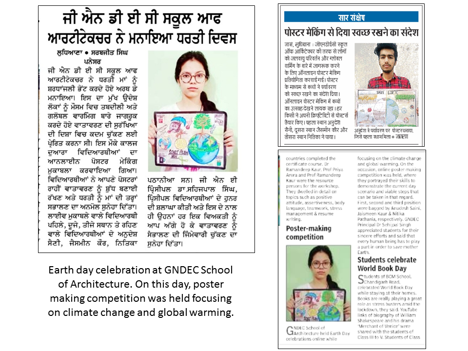
- **EXPERT GUEST LECTURE ON SCHOOL DESIGN PROJECT BY AR.HARINDER BOPARAI, PRINCIPAL ARCHITECT-BOPARAI ARCHITECTS AND ENGINEERS, LUDHIANA ON 20TH NOVEMBER.**  

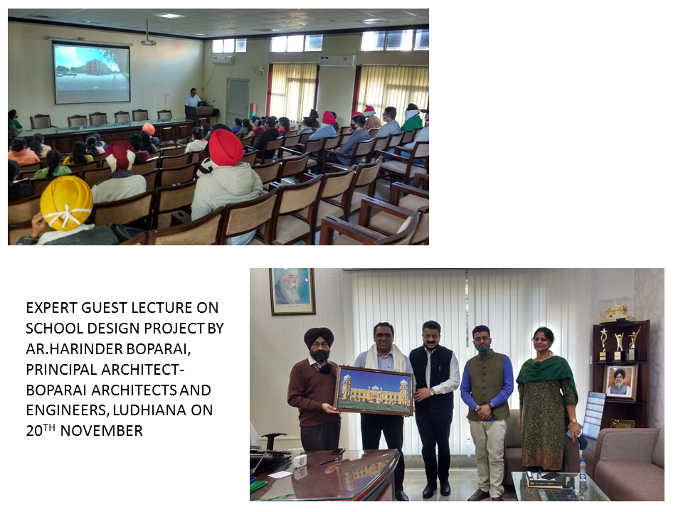
- **GNDEC, Ludhiana organized International Congress-Sustainable Development through Engineering Innovations. Online Presentations from Architecture domain were conducted on 19th September, where numerous Architects, planners, urban designers and policy makers attended the same.**  

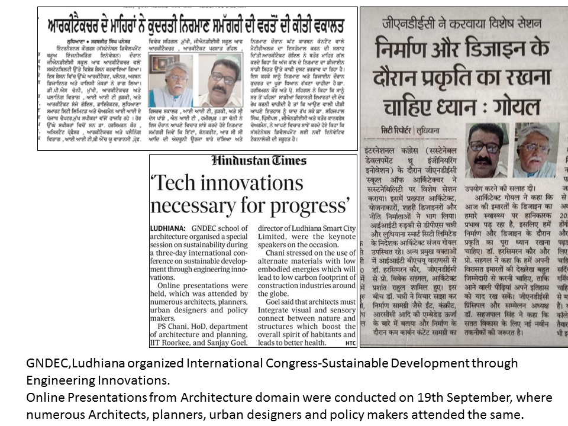  

- **GNDEC, Ludhiana organized an online activity on the occasion of “ENVIRONMENT DAY” for the students of architecture where they have to make useful models  from the waste.**  

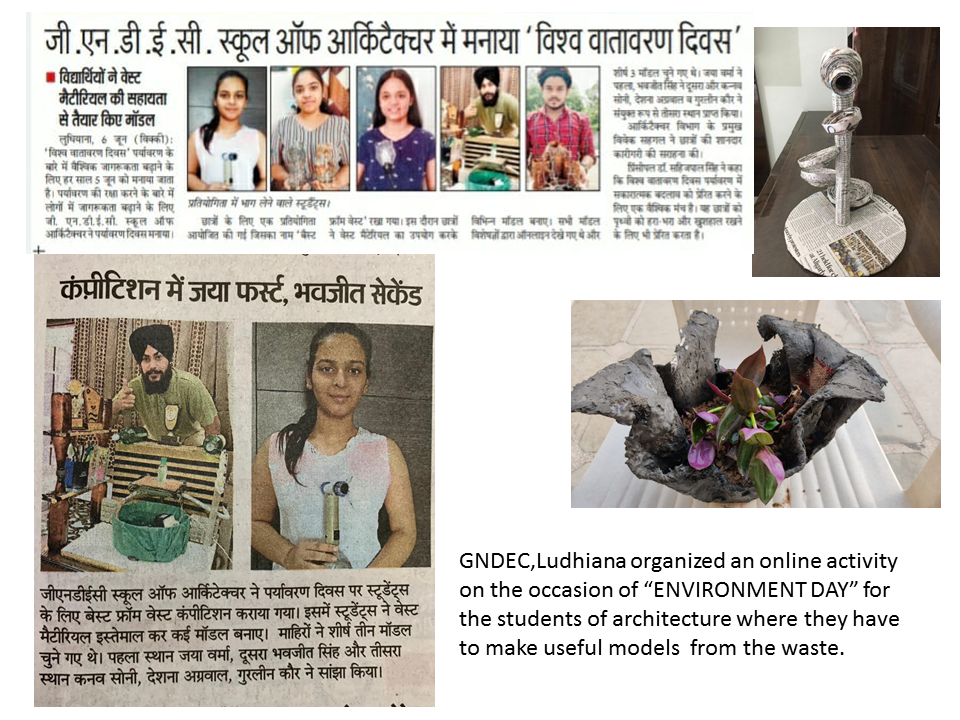  

- **GNDEC, Architecture School organized a hands-on workshop on Building Construction involving students from 1st and 2nd year, where they worked on designing and construction of outdoor furniture. The students were exposed to the operation of the designs, from paper to on-ground execution, experimenting with bricks, cement, sand etc. and also understanding the probable obstacles that might peep in during construction process**  

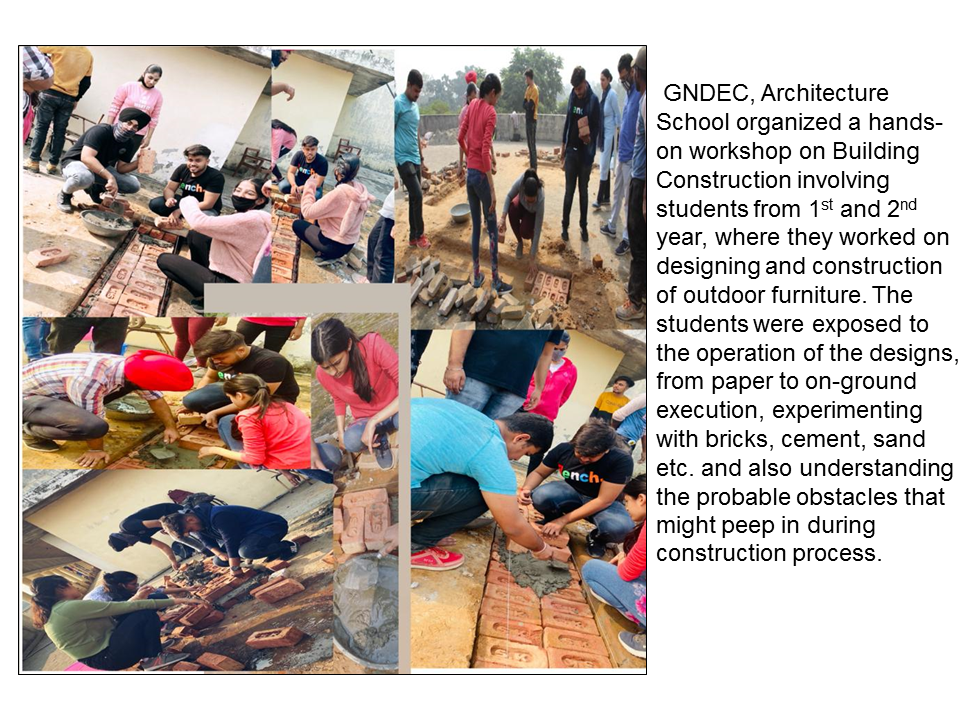
- **GNDEC, School of Architecture, Ludhiana in association with IIA, Ludhiana center organized an “ open house discussion” on “EFFECTS OF LOCKDOWN ON ARCHITECTURE PROFESSION”**  

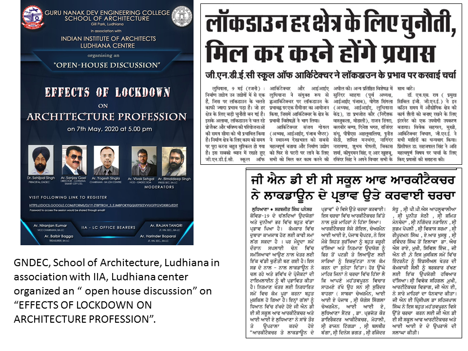
- **GNDEC, School of Architecture, Ludhiana organized an online awareness program for female students and staff on the topic “ELIMINATION OF VIOLENCE AGAINST WOMEN”**

 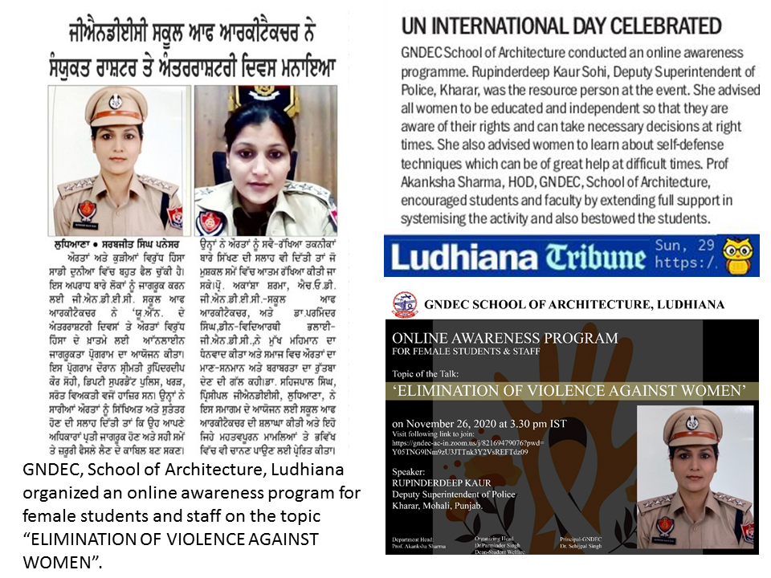
- **GNDEC, School of Architecture, Ludhiana organized an online expert lecture for architecture students on the topic “RESIDENTIAL DESIGN PROJECTS”**  

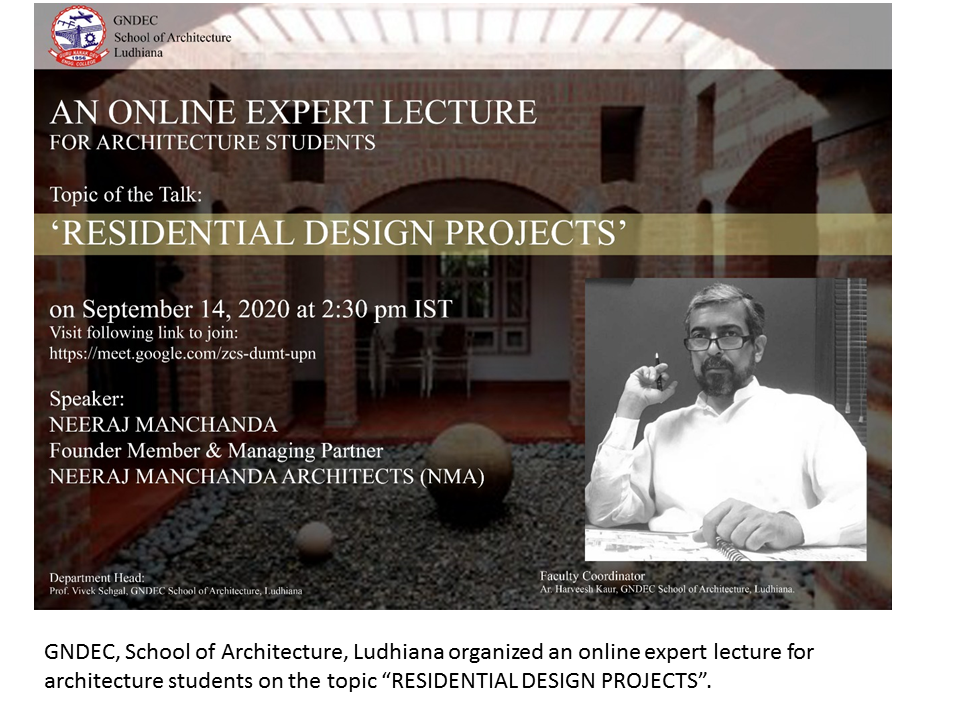
- **GNDEC, School of Architecture, Ludhiana organized an online expert lecture for architecture students on the topic “SUSTAINABILITY IN ARCHITECTURE”**  

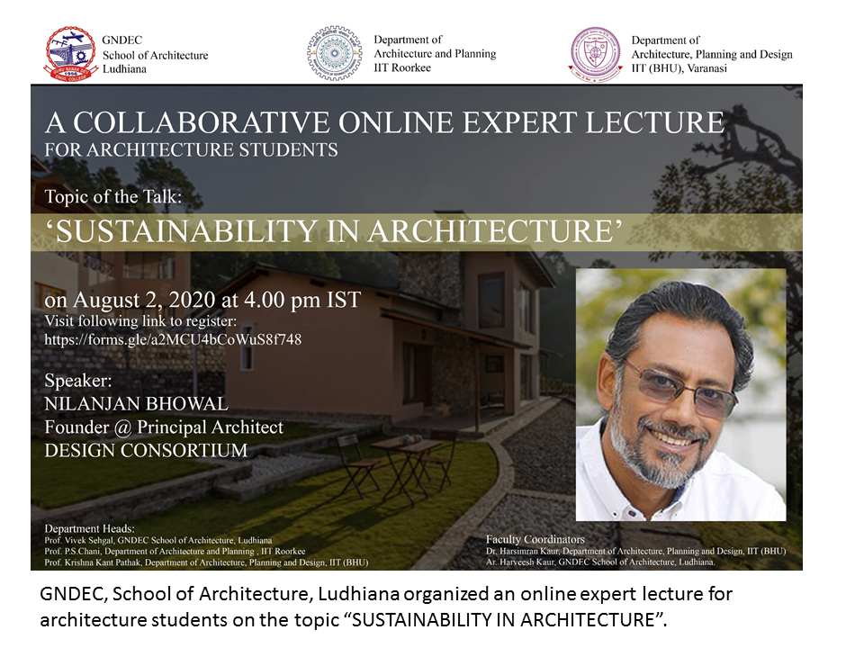
- **GNDEC, School of Architecture, Ludhiana took an initiative towards the environment and structured an online panel discussion on the “PRESENT PANDEMIC AND ENVIRONMENT REVIVAL”**  

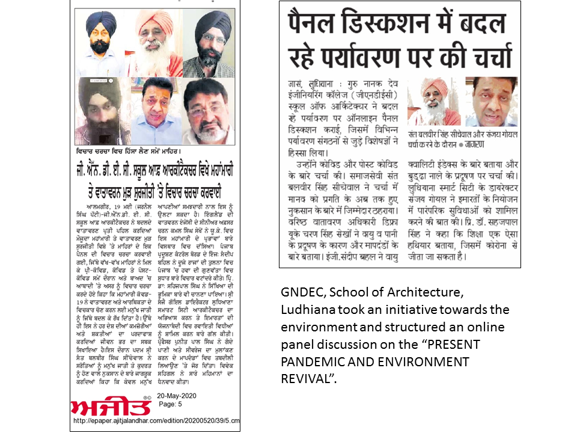
- **GNDEC, School of Architecture, Ludhiana took an initiative for conducting classes and a series of webinars**  

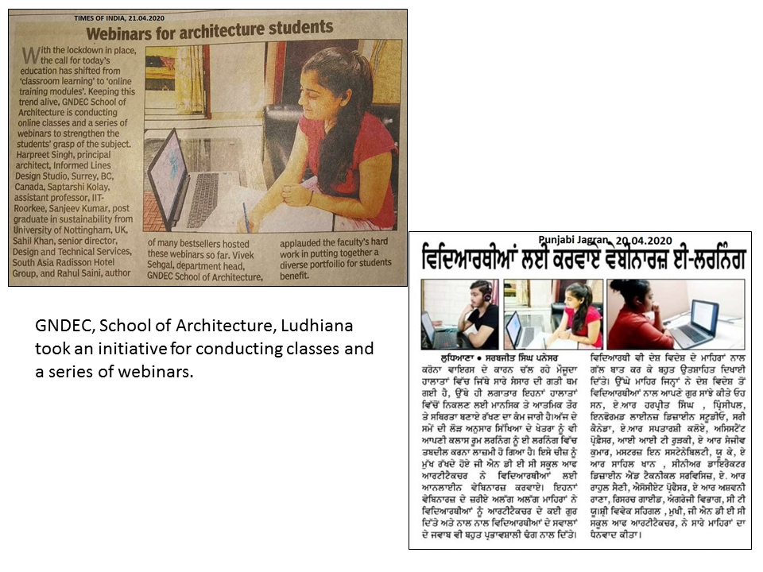
- **GNDEC, School of Architecture, Ludhiana marked world architecture day and U N World Habitat Day by conducting a series of online expert lectures on the topic “HOUSING FOR ALL”**  
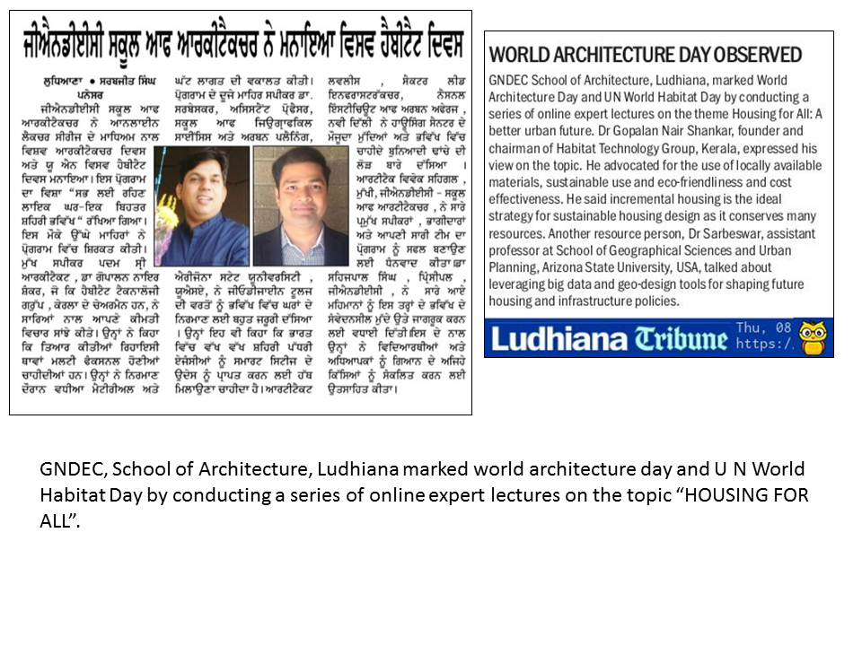

## Faculty Achievements  

- Ar. Akanksha Sharma (HOD, School of Architecture has been awarded the “A3 Foundation Teacher Award” 2019-2020.  

- Ar. Akanksha Sharma (HOD, School of Architecture has been awarded “Best Professor in Sustainable Architecture” by Academic Excellence Awards 2020.
- Ar. Akanksha Sharma (HOD, School of Architecture has been awarded Teacher Appreciation Award Awarded by Lovely Professional University, Phagwara (Punjab)

## Publications  

- **Ar. Akanksha Sharma**, ‘Approaches to Sustainable’ Conference at Apeejay College of Fine Arts Jalandhar (2011).  

- **Ar. Akanksha Sharma**,
‘Cultural transformation through design sub theme learning from our traditional authenticity and design’ Conference at Apeejay College of Fine Arts Jalandhar (2011)
- **Ar. Akanksha Sharma**,“Emerging Need for Incorporating Sustainable Principles in Building and Habitat Design” Sustainable Innovative Techniques in Architecture, Civil and Environment Engineering, ISBN : 978-1-63248-030-9, 26-27th April 2014
- **Ar. Akanksha Sharma**,“A Way for Sustainable Living”Descriptio An International Refrred Journal of Apeejy College of Fine Arts,Jalandhar,(India)ISSN No.22494480 Vol No 2014.
- **Ar. Akanksha Sharma**,“Larning from our Transformation Ethnicity and Design” Descriptio An International Refrred Journal of Apeejy College of Fine Arts,Jalandhar,(India)ISSN No.22494480 Vol No 2014.
- **Ar. Akanksha Sharma**, “Challenges in Sustainable interior Design: A Study of Ludhiana “ NICHE, Neo-International Conference on Habitable Environments & International Professional Meet 2016, 11th-13th November 2016.
- **Ar. Akanksha Sharma**, “Passive Construction Techniques: A Review on Residential Buildings of Ludhiana” JETIR December 2018, Volume 5, Issue 12,Journal of Emerging Technologies and Innovative Research (JETIR) 
- **Ar. Akanksha Sharma**,“ Kalka Shimla Railway- World Heritage Site “,JETIR December 2018 Volume 5, Issue 12
- **Ar. Akanksha Sharma**,“Stratergies for mitigating urban heat island in model town jalandhar punjab india” , IJRAR1BLP152 International Journal of Research and Analytical Reviews (IJRAR)

## Events Organized (FDPs/Conferences/STCs/SDTs/Workshops/Webinars etc.)  

| Sr. No. | Name of Faculty  | Name of Event                                    | Duration | Date(s) | Organizing Institute |
|:--------|:-----------------|:-------------------------------------------------|:---------|:--------|:---------------------|
| 1       | AR. VIVEK SEHGAL | “EFFECTS OF LOCKDOWN ON ARCHITECTURE PROFESSION” | 1 Day    | 7TH MAY | GNDEC LUDHIANA       |
| 2       | AR.NAVJOT KAUR   | “ELIMINATION OF VIOLENCE AGAINST WOMEN”.         | 1 Day    | 26 NOV  | GNDEC LUDHIANA       |
|         | AR.HARVEESH KAUR | “ELIMINATION OF VIOLENCE AGAINST WOMEN”.         | 1 Day    | 26 NOV  | GNDEC LUDHIANA       |
| 3       | AR.HARVEESH KAUR | "RESIDENTIAL Design PROJECTS"                    | 1 DAY    | 14 SEP  | GNDEC LUDHIANA       |
| 4       | AR. VIVEK SEHGAL | “SUSTAINABILITY IN ARCHITECTURE”.                | 1 DAY    | 02 AUG. | GNDEC LUDHIANA       |
| 5       | AR. VIVEK SEHGAL | “conducting classes and a series of webinars”.   | 1 DAY    | 20APRIL | GNDEC LUDHIANA       |

## Events Attended (FDPs/Conferences/STCs/SDTs/Workshops/Webinars etc.)  

| Sr. No. | Name of Faculty     | Name of Event                                        | Duration | Date(s)               | Organizing institute |
|:--------|:--------------------|:-----------------------------------------------------|:---------|:----------------------|:---------------------|
| 1       | AR.Akanksha Sharma  | “Heritage understanding”                             | 1 Day    | 18 Sep 2020           | INTACH               |
| 2       | AR.Akanksha Sharma  | “Capacity Building Workshop IV                       | 3 Day    | 24 - 26 April 2017    | INTACH               |
| 3       | AR.Akanksha Sharma  | “Rohini Project Planning (Training)                  | 1 Month  | 3 June - 5 July 2002  | DDA                  |
| 4       | AR.Akanksha Sharma  | "Basic Design and Building Information Modelling"    | 1 Week   | 16 Dec - 22 Dec 2010  | LPU                  |
| 5       | AR.Akanksha Sharma  | “Design Theory: Critical Reading and Writing Skills" | 6 Days   | 27 June - 2 July 2012 | LPU                  |
| 6       | AR. VIVEK SEHGAL    | “Teaching Indian Architectural History"              | 5 Days   | 11 - 15 May 2020      |                      |
| 7       | AR. VIVEK SEHGAL    | “Data Analysis"                                      | 3 Days   | 20 - 22 Jan 2021      |                      |
| 8       | AR. Harshpreet Kaur | “The Landmark Forum"                                 | 5 Days   | 15 - 19 Nov 2019      |                      |
| 9       | AR. Navjot KAUR     | “Interior Exterior Expo"                             | 3 Days   | 7 - 9 Feb 2020        | ECBC                 |

## Miscellaneous (Lab Upgradation, Infrastructure augmentation etc.)  

- The Department has facilities like Studios, Lecture halls, Computer Labs equipped with latest design software used in professional practice, an Art Lab and a Workshop. Also, department library, climatology lab, survey lab, audio visual room and printing lab will be added shortly in our department.  

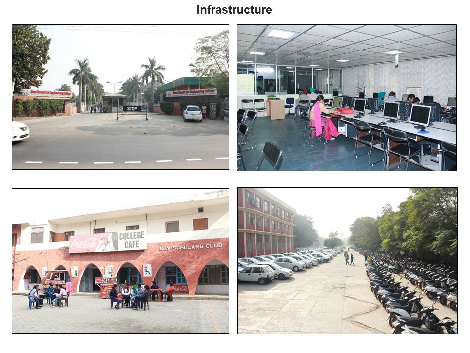 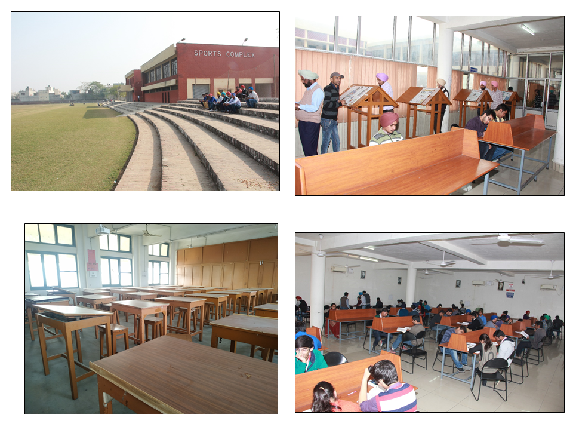 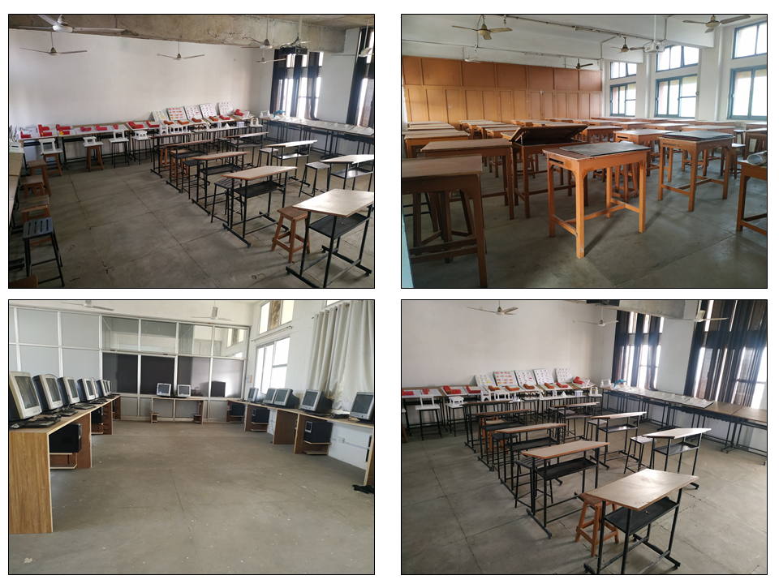

## Student's Corner

- EDUCATIONAL VISIT TO VIRASAT-E-KHALSA, ANANDPUR SAHIB, PUNJAB ON 06TH FEBRUARY 2020
- EDUCATIONAL VISIT TO INT-EXT EXPO, CHANDIGARH ON 07TH FEBRUARY 2020
- INTERACTION WITH AR.SANGEET SHARMA IN LE-CORBUSIER CENTRE, CHANDIGARH ON 08TH FEBRUARY 2020
- INTERACTION WITH AR.VARUN DHAM IN LE-CORBUSIER CENTRE, CHANDIGARH ON 08TH FEBRUARY 2020
- INTERACTION WITH AR.RENU KHANNA AT HER OFFICE IN SECTOR 10 PANCHKULA ON 08TH FEBRUARY 2020
- SITE VISIT TO 24 STOREYED MLA TOWERS NEAR CHANDIGARH ON 06TH FEBRUARY 2020
- INTERACTION WITH AR.SANJAY GOEL AT GNDEC SCHOOL OF ARCHITECTURE ON 23RD JANUARY 2020

#### Student's Achievements

- **PARTICIPATED IN 62ND YEAR ZONAL NASA CONVENTION ZONE-1:**
Kanav Soni has been awarded a certificate for participating in Transparence Workshop held during the Zonal NASA Convention 2019.

- Bhavjeet Singh of GNE - School of Architecture, Ludhiana has been awarded the A3F Poetry Award for the entry in the A3 Foundation Awards (2019 - 2020)
- Gurleen has participated in ISTE CARNIVAL 2020 and securing 3rd position in event of poster making held during 22 July - 30 July 2020.
- Ishika Arora has been awarded a certificate for participating in the COA international Essay Writing competition 2020.
