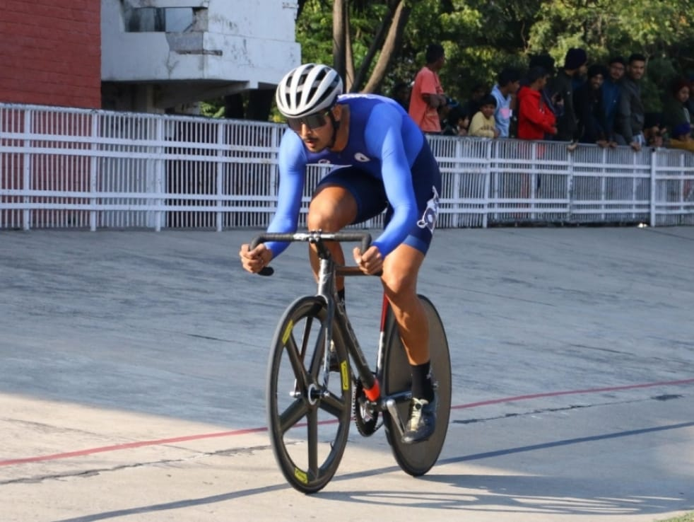

# Extramural Activities
## International & National Achievers  

**Harhveer Singh Sekhon of MBA-2005187(Silver Medalist in 30Km Point Race in All India Inter-varsity Track Cycling Champioship Held at Punjabi University,Patiala  from 5th-9th December 2021**  

  
  

**IKGPTU Inter-varsity Participation**

| Sr. No. | Name | Roll No. | Branch | Game | Venue | Dates | Photograph |
| - | -- | - | - |-| - | - | - |
| 1 | Jaismeen Kaur | 1917587 | B.Arch. |Cycling |Punjabi University,Patiala |5th-9th December 2021 |  |
| 2 | Ayush Jindal| hdd | M.Tech(Str.Engg.) |Table tennis |Chitkara University,Baddi |30th December2021 to 2nd Januray2022 |  |
| 3 | Divyanshu | 1905095 | B.Tech.3rdyrEE |Football |Punjabi University,Patiala |23rd-30th December 2021 |  |
| 4 | Tamanpreet Singh|2104577| B.Tech(IT) |Table tennis |Chitkara University,Baddi |30th December2021 to 2nd Januray2022 |  |

**Jaismeen Kaur Toor of D3-B.Arch-1917587**  

***Winner Cycling Team***

***Winner Cycling Team***
