# Extramural Activities
## International & National Achievers  

**Harhveer Singh Sekhon of D4CSE-1606693(Silver Medalist in Asia Cup in Tack Cycling & Twin Gold medalist in All India Road Cycling Inter-versity Championship)**  

  

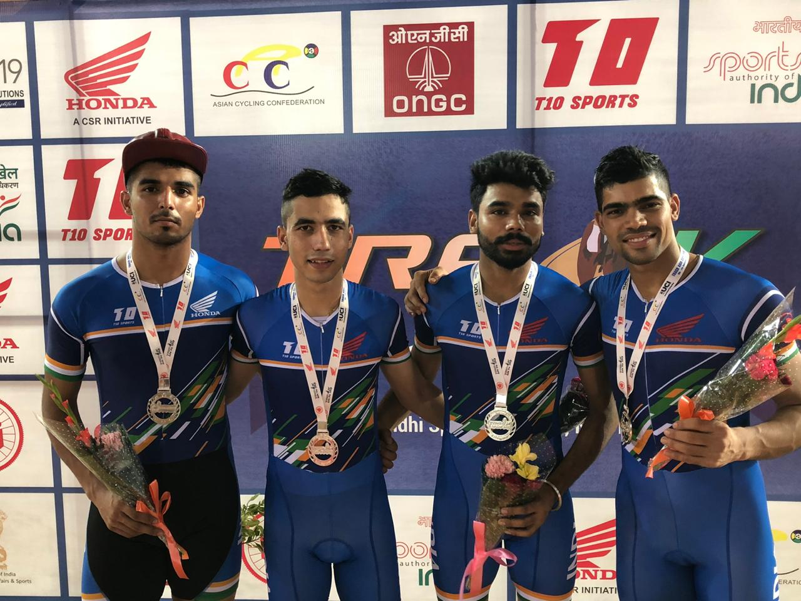

**Punarpratap Singh Sidhu of D1CSE-1905032(Siver Medalist in North Zone Skeet Shooting Championship)**  

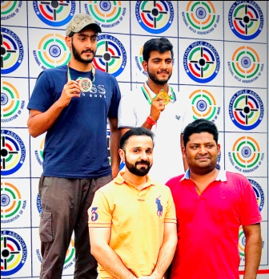  

**Jaismeen Kaur Toor of D1-B.Arch-1917587(PTU Best Cyclist)**  

**Sandhya kumari of D2CSE-1805221(Brinze Medalist in PTU Crosscuntry Meet)**

**IKGPTU Inter-college Tournaments
The teams in different games bagged first three positions in PTU Inter-college Tounaments in boys and girls, respectively**

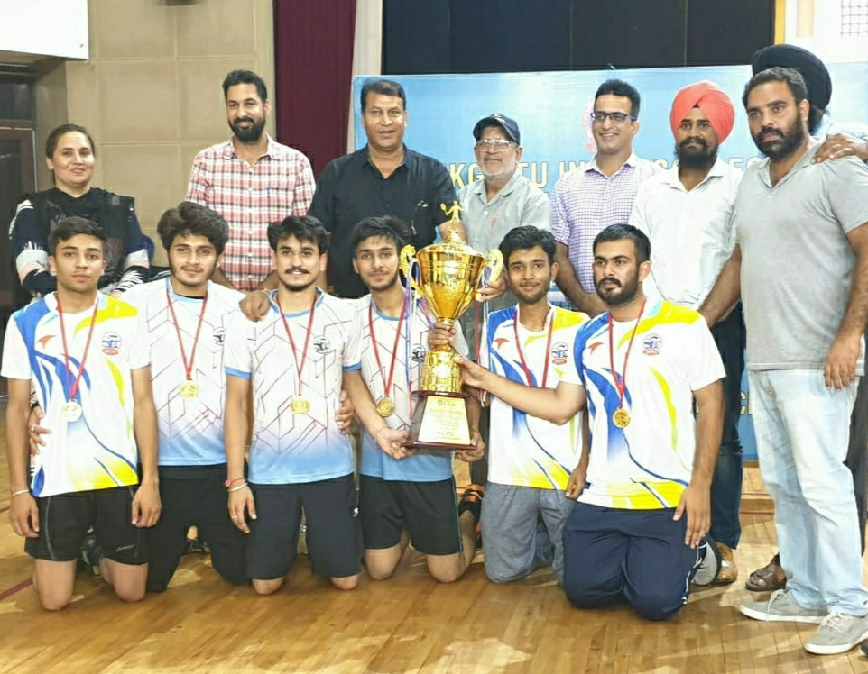
***Winner Badminton Team***

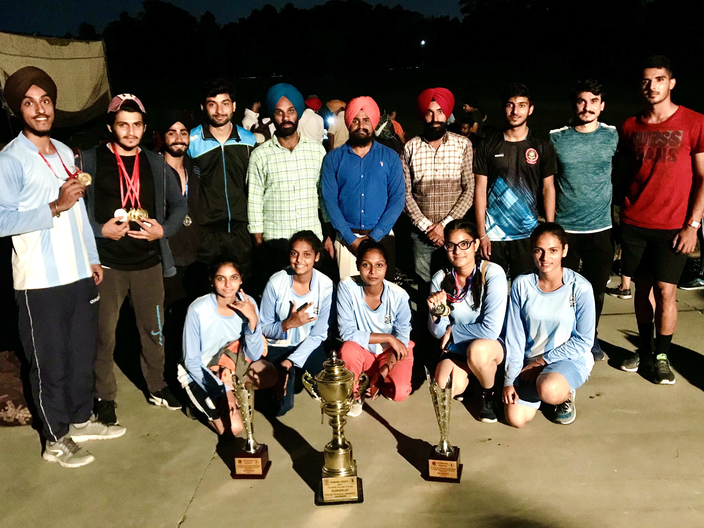
***Winner Cycling Team***

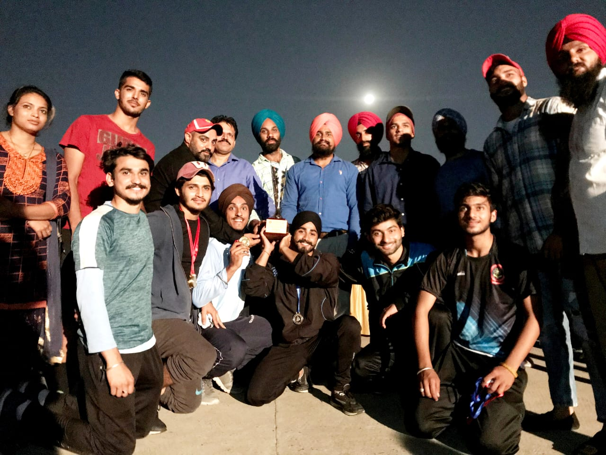
***Winner Cycling Team***

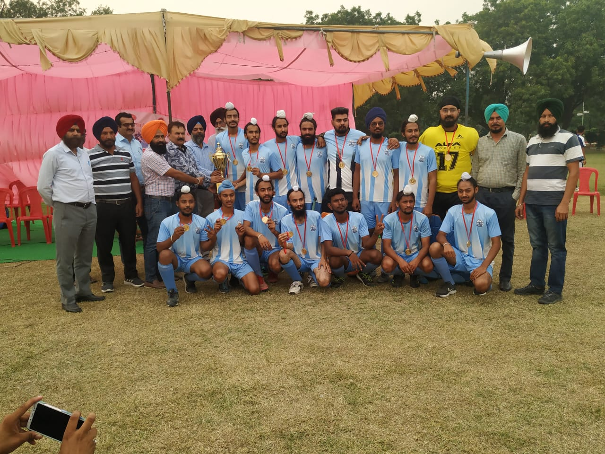
***Winner Hockey Team***

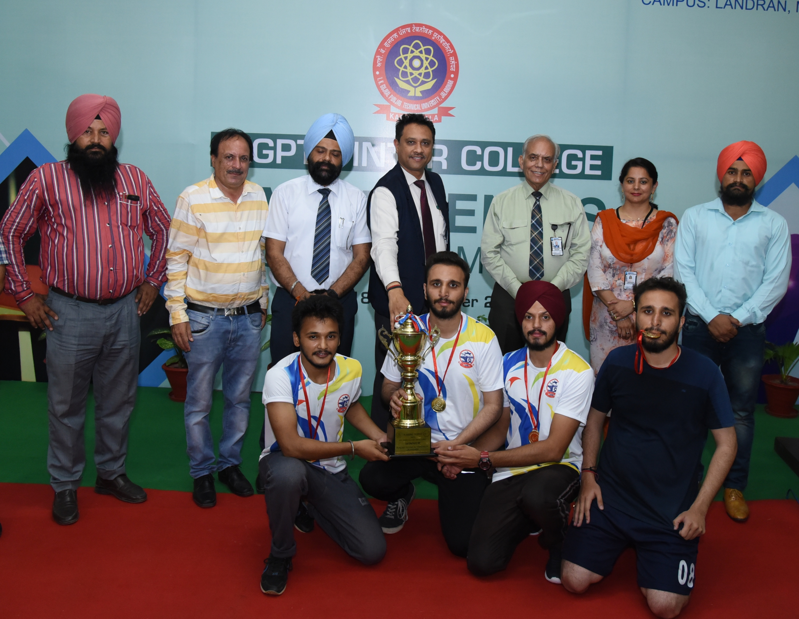
***Winner Table-tennis Team***

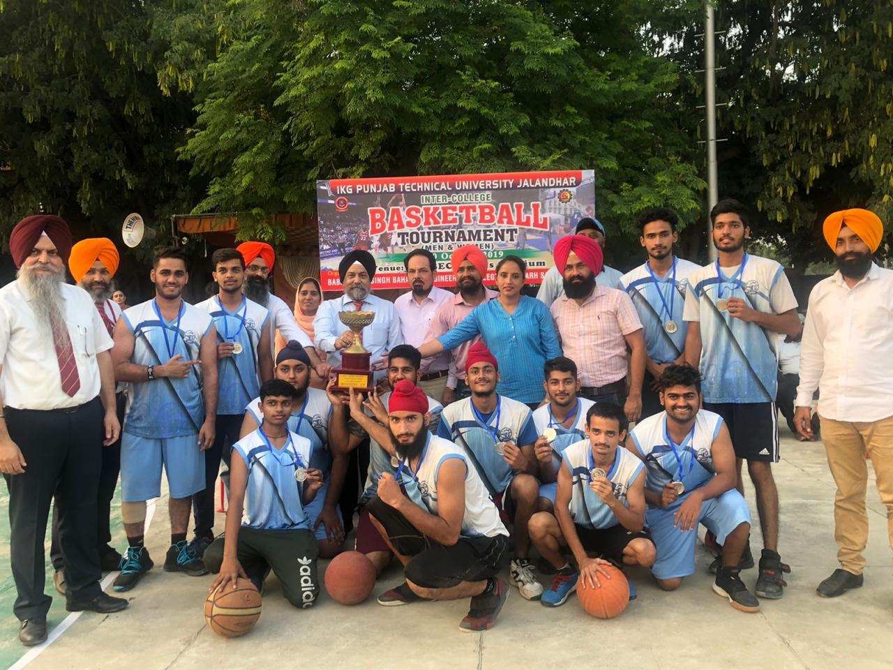
***Runner-up Basketball Team***

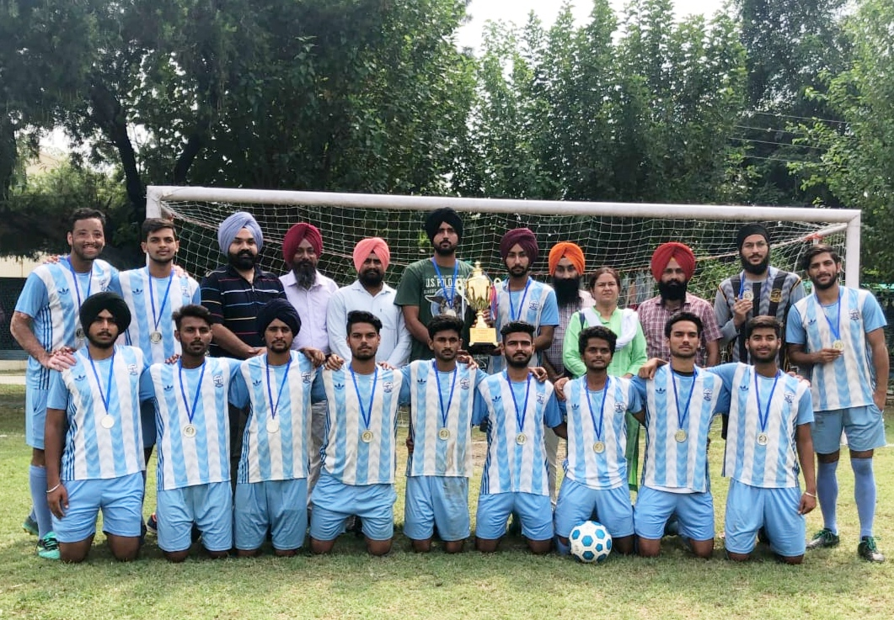
***Runner-up Football Team***

***Runner-up Cross-Country Team***

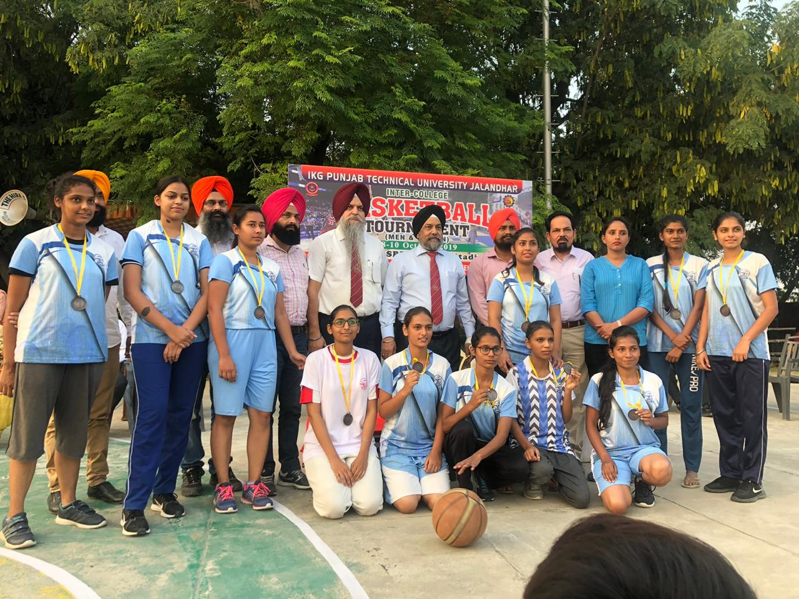
***Third Basketball Team***

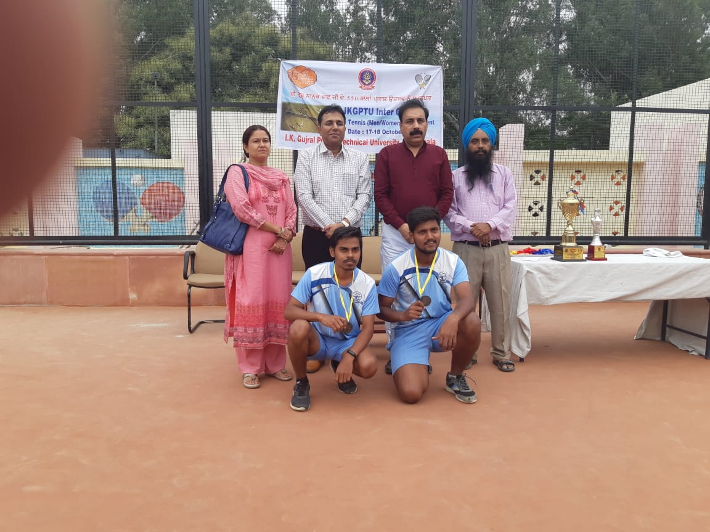
***Third Lawn-tennis Team***

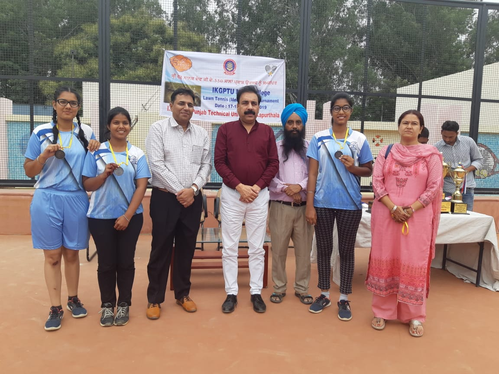
***Third Lawn-tennis Team***

***Third Cross-Country Team***

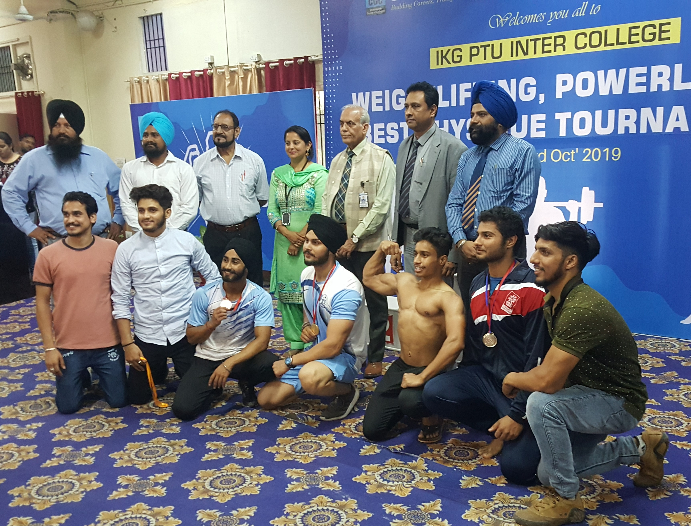
***Third Power-Lifting Team***
